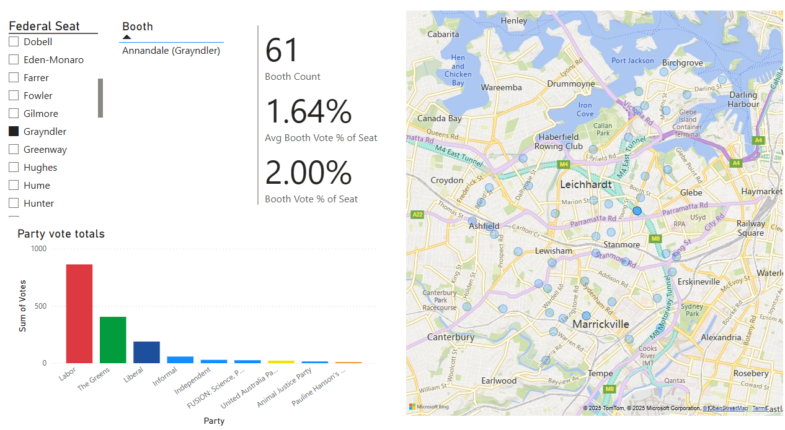

# Comparing the 2022 and 2025 Federal Elections

This project builds an ETL pipeline that scrapes and processes election data from the Australian Electoral Commission (AEC), combining live 2025 results with preformatted data from the 2022 election to enable meaningful comparisons.

The processed data is loaded into Power BI, where an interactive report allows users to compare booth-level results geographically. Users can explore individual electorates and polling booths through a dynamic map interface.

Below is a snapshot of the report. In this example, the seat of Grayndler is selected, and all polling booths within it are shown on the map. The Annandale booth has been clicked, revealing vote counts for each party. The report also displays the average percentage of voters at each booth alongside the specific percentage of voters at the selected booth, helping viewers understand how much each booth contributes to the final vote.
  

